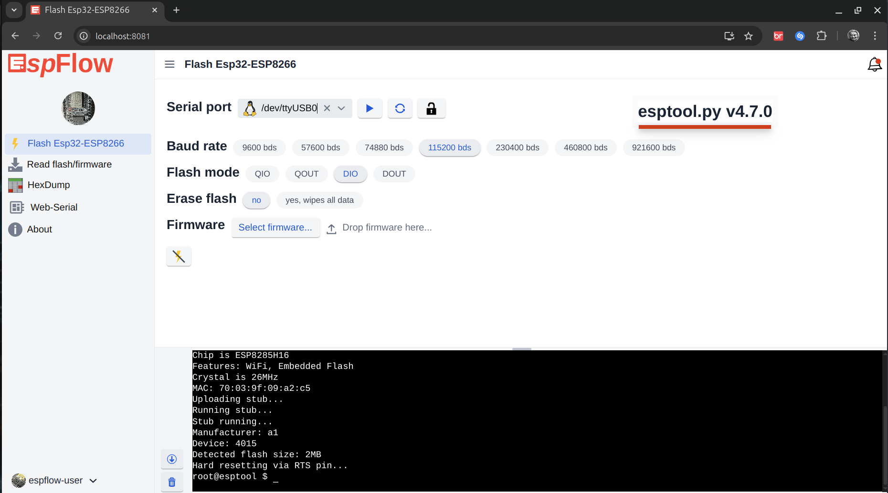
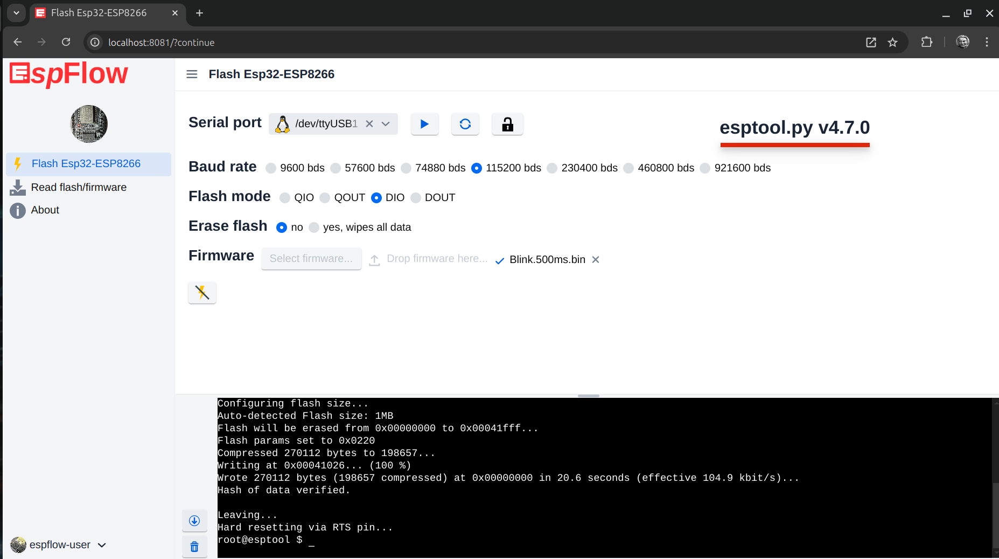
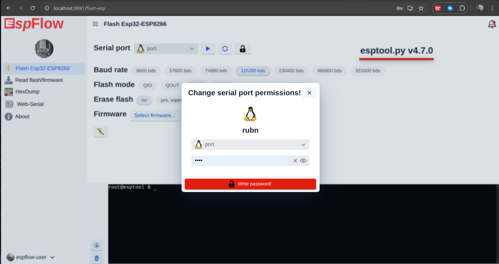

= EspFlow

:icons: font

This project is inspired by the https://github.com/marcelstoer/nodemcu-pyflasher[nodemcu-pyflasher^]

The UI is based on Vaadin Flow and allows invoking `esptool.py` to execute operations common to microcontrollers of the esp32, and esp8266 family.

== Flash View

=== `flash_id`

with this command we read basic information from the microcontroller.

=== `write_flash`

to write the firmware

=== `Change serial port permissions!` 

to change the permissions on the serial port

== Read firmware View

=== `read_flash`

Backup of the microcontroller firmware with, with the possibility to set the memory sections to be read, custom initial and final read size, or `ALL` for full read.

[source,sh]
----
esptool.py --port /dev/ttyUSB1 --baud 11500 read_flash 0 ALL /tmp/esp-backup-flash-dir/ESP8266EX-1720865320370-backup.bin
----

image::https://github.com/user-attachments/assets/9a4631f4-d5ad-4d33-9d87-6909a38fd5ad[]

== *New features*, will be coming soon ⚒

- espefuse.py support
- espsecure.py support
- parttool.py support
- Remote Serial Ports RFC2217 (Telnet) protocol.

== Running the application

The project is a standard Maven project. To run it from the command line,
type `mvnw` (Windows), or `./mvnw` (Mac & Linux), then open
http://localhost:8080 in your browser.

You can also import the project to your IDE of choice as you would with any
Maven project. Read more on [how to import Vaadin projects to different 
IDEs](https://vaadin.com/docs/latest/flow/guide/step-by-step/importing) (Eclipse, IntelliJ IDEA, NetBeans, and VS Code).

== *Environment* variables must be set to login with the esptool user

These environment variables can also be set in the `IDE` for convenience.

- `*ADMIN_ESPFLOW_USER*`
- `*ESPFLOW_PASSWORD*`

https://github.com/rucko24/EspFlow/blob/main/src/main/resources/application.yml[see application.yml file^]

== Deploying to Production

To create a production build, call `mvnw clean package -Pproduction` (Windows),
or `./mvnw clean package -Pproduction` (Mac & Linux).
This will build a JAR file with all the dependencies and front-end resources,
ready to be deployed. The file can be found in the `target` folder after the build completes.

Once the JAR file is built, you can run it using

[source,sh]
----
java -jar target/espflow-1.0-SNAPSHOT.jar --ADMIN_ESPFLOW_USER=xxxx --ESPFLOW_PASSWORD=xxxx
----

